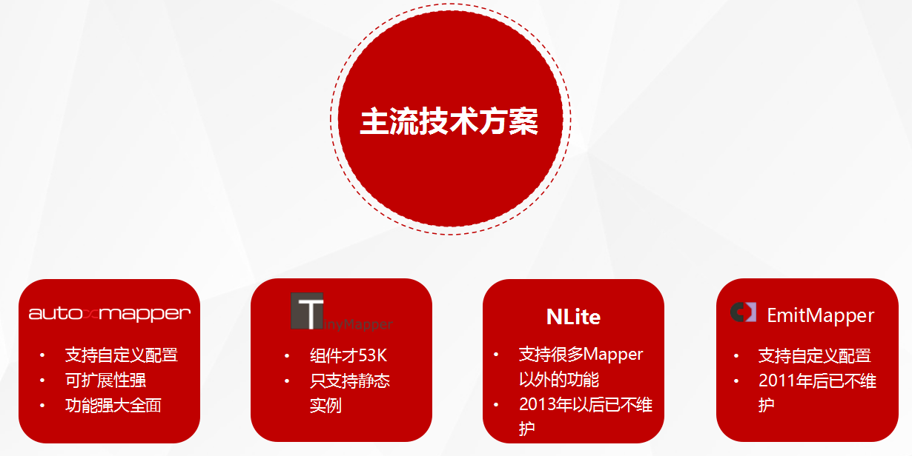

## 一、知识点

1. 为什么需要自动化对象映射？

因为项目开发经常遇到的两大核心问题：如何提高效率、如何提升质量。

2. 它可以做什么？

通过快速实现类对象间的映射（主要解决DTO与模型间的赋值转换）问题，减少编码，从而提高开发效率。

3. 主流技术方案

## Project Description
Powerful customisable tool for mapping entities to each other. Entities can be plain objects, DataReaders, SQL commands and anything you need. The tool uses run-time code generation via the Emit library. It is usefull for dealing with DTO objects, data access layers an so on.
## Supported platforms:

* Microsoft .NET Framework 3.5
* Microsoft Silverlight 3
* Mono
## About Emit Mapper

* Overview
* Benefits of Emit Mapper
* Getting started
* Type conversion
* Customization

# Customization overview

Customization using default configurator
* Default configurator overview
* Custom converters
* Custom converters_for_generics
* Null substitution
* Ignoring members
* Custom constructors
* Shallow and_deep_mapping
* Names matching
* Post processing

Low-level customization using custom configuratorors
# Emit Mapper in practice.

* Benchmark: EmitMapper vs Handwritten code vs AutoMapper
* Objects change tracking
* Mapping DbDatareader to objects
* Mapping objects to DbCommand (UPDATE and INSERT)
Last edited Jan 11, 2010 at 3:01 PM by romankovs, version 25
from http://emitmapper.codeplex.com/
